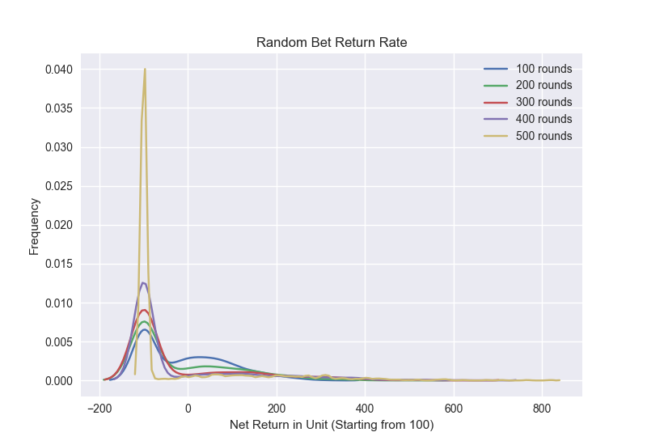
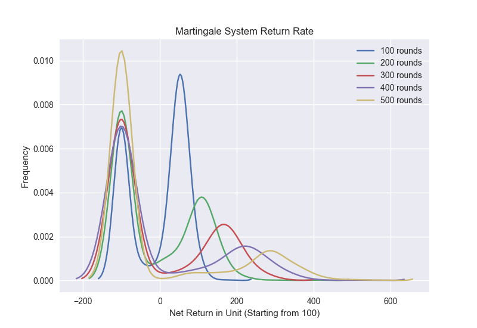

# Reinforcement Learning to Discover Betting Strategy

Draft
## Inspiration : *The Sting* (1973)

As an avid movie lover, one of the toughest question is to name my all-time favorite movie. Certainly, it seems almost impossible to pick my all-time favorite; however, the up-lifting opening sequence of *The Sting (1973)* will always have a special place in my heart.

This Oscar winning crime comedy is the story of 2 con artists; the young and fearless Hooker played by Robert Redford, and the old and experienced Henry played by Paul Newman. Both conmen seek revenge on a Chicago mobster, Lonnegan, who murdered one of their mutual fellows. In spite of the opposing characteristics, 2 conmen show chemistry and plan the biggest set-up to win their money back from Lonnegan.

Without spoiling too much, the theme of this classic is **take small losses, but never miss big wins**.

This inspired me to answer a following question:
**Can machine learning understand the concept of accepting loss for the sake of large wins in the future?**

## Problems

Conventional supervised learning requires a set of inputs and labels. For example, a model predicts the optimal hands to play given a game state such as the amount of money you have and how strong your current hands are. This means we need to know the optimal actions to take given the input even before training the model.

The challenge of our situation is that we don't know the optimal solution when we start the simulation. This means, our model needs to explore the environment without any previous knowledge and develop the strategy through their experiences. This technique is called **reinforcement learning**, and we are going to simulate the situation of accepting loss for the larger win using this concept.
For this purpose, I concluded that the card game **baccarat** and the discovery of the optimal betting strategy would be a perfect simulation.

## Why Baccarat

Baccarat is one of the simplest games in casino. The twist is that you don't even need to know how to play. Players only need to guess the winner of the next game and bet on it. There are only 3 options: player wins, banker(dealer) wins, or they tie. If a player guesses correctly, he/she will get the money back based on how much he best. There are mainly two reasons why I chose this particular environment.

* **1. Players can simply keep betting on dealer.**

Here it is. This is the golden rule. In Baccarat, you will get the highest return when you guess tie correctly, but it is the riskiest hands to play. In fact, it is already known the **exact** probability and the expected value of each hand. In theory, if you play the game of Baccarat long enough, each hands should converge to the following probability. Hence, our model can simply keep betting on banker: a hand with the highest expected value.


  |        | Probability of Winning |  Return | Expected Value  |
  |--------|------------------------|---------|-----------------|
  | Player |          .4462         |  +1     |   -0.012351     |
  | Banker |          .4585         |  +.95   |   -0.010579     |
  | Tie    |          .0953         |  +8     |   -0.143596     |


* **2. This game is all about short/long-term betting strategy**

The existing strategy of Baccarat is all about the repetition of an identical pattern. All strategies expect players to bet on banker all the time. It's a systematic pattern that can be evaluated mathematically. For example, the famous 1324 system works as follows: Starting from 1 unit of your bet, you will bet progressively with the sequence of 1 unit, 3 units, 2 units, 4 units until you lose. If you lose, you start over from 1. If you complete the sequence, you will also start over from 1. As you see, this process is easily programmable. From this reason, our learning model is able to simplify the strategy and only focus on the discovery of this betting pattern.   


## Game State

## Simulation Environment

As explained above, the game of Baccarat allowed me to write a simple code and simulate the game environment. 
```Python
def deal(self):
    ''' Baccarat dealing simulator based on the actual probability

    Simulate one deal of bacarrat with odds from http://www.baccaratstrategies.net/Baccarat-Probabilities.html

    player odds : 44.62%
    dealer odds : 45.85%
    tie : 9.53 %

    Args: None

    Return: integer encoding of game result
        0 : player wins
        1 : dealer wins
        2 : tie
    '''
    prob = random()
    # player wins with 44.62%
    if prob < .4462:
        return 0
    # dealer wins with 45.85%
    elif prob < .9047:
        return 1
    # tie with 9.53%
    else:
        return 2
```
This is the core of game engine. For each game simulation, Player class will make a decision about betting price. By default, Player class will wait for the user input and decides the betting price. For any AI players, I overload the function to determine the betting and either program the set of existing strategies or train reinforcement learning model to discover one.

## Training

## Result
The following is the distribution of net win, starting with 100 units of money (0 means the agent leaves the game with 100 units). The peak at -100 indicates the agent lost money completely, and the peak in the positive range indicates the agent left the game with some profits.

- Baseline (Random bet)

The longer the agent plays, the riskier this strategy becomes. Intrestingly, it has the highest upper range (around 800). 
<p align="left">
  
</p>

- 31 System 

Playing 100 games with 31 Systems have a decently high probability to leave the game with some profits.
<p align="left">
  
</p>

- Martingale System

The longer the agent plays, the riskier this strategy becomes. However, the return becomes larger (with decreasing probablity)
<p align="left">
  
</p>

- 1324 System

The agent can finish playing the game without losing money. Low risk low return.
<p align="left">
  
</p>
